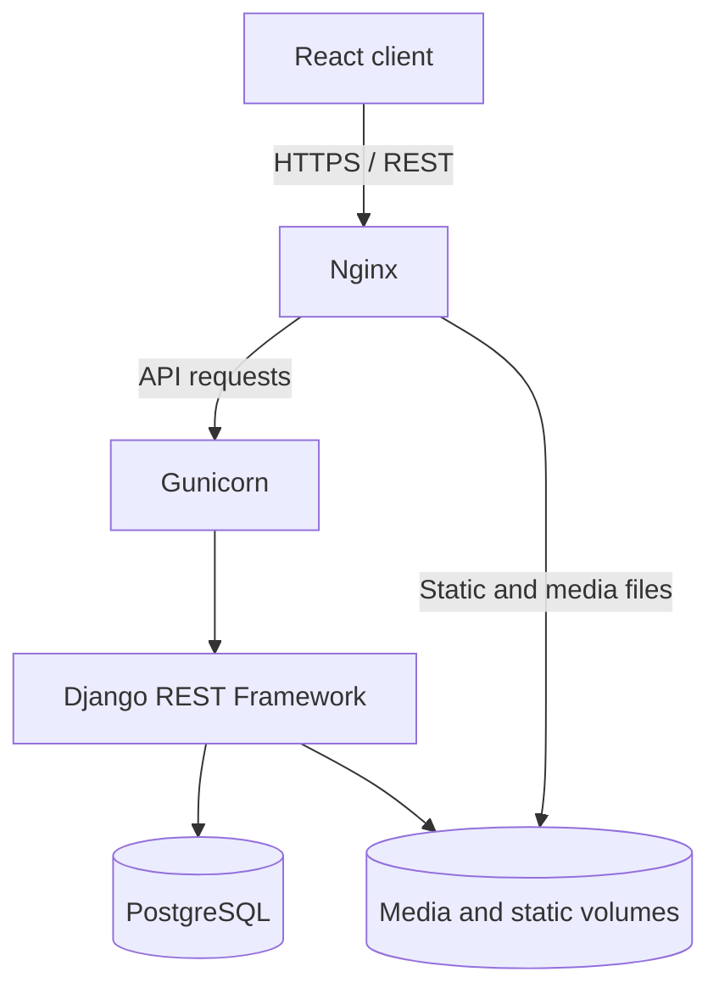
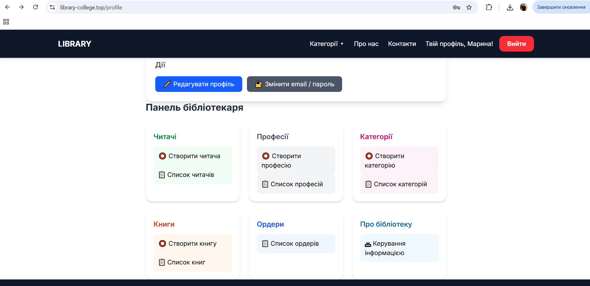
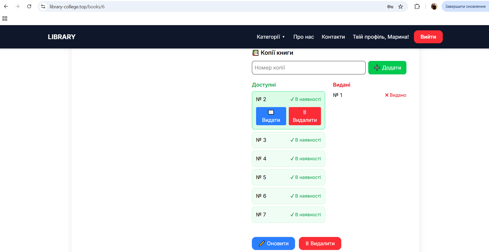
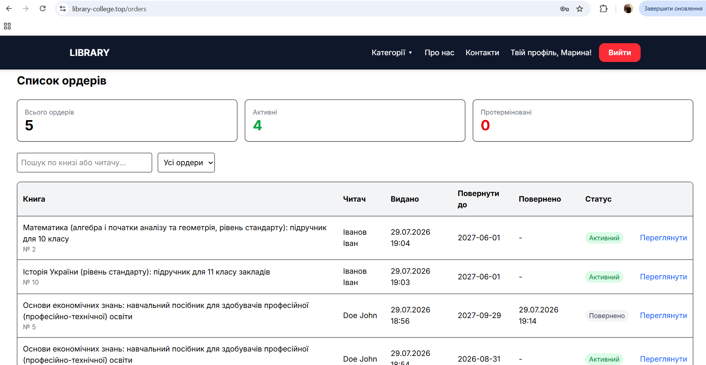
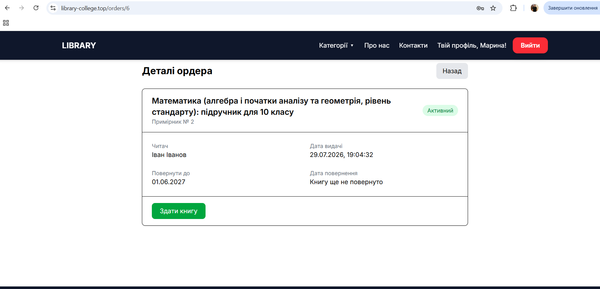
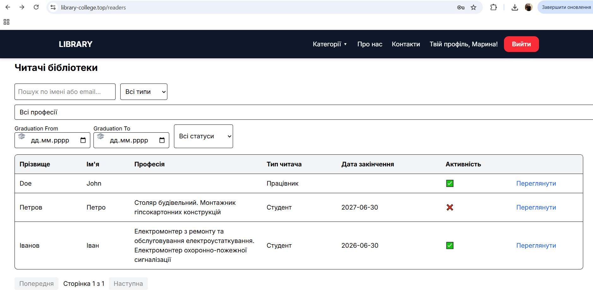
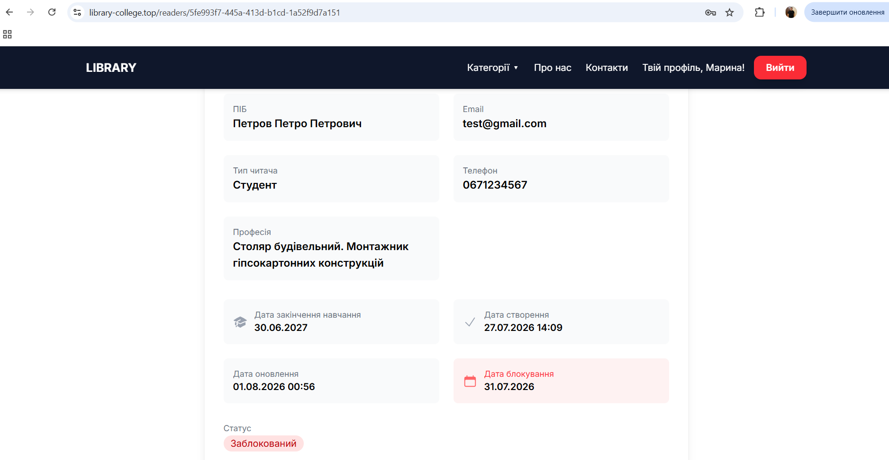
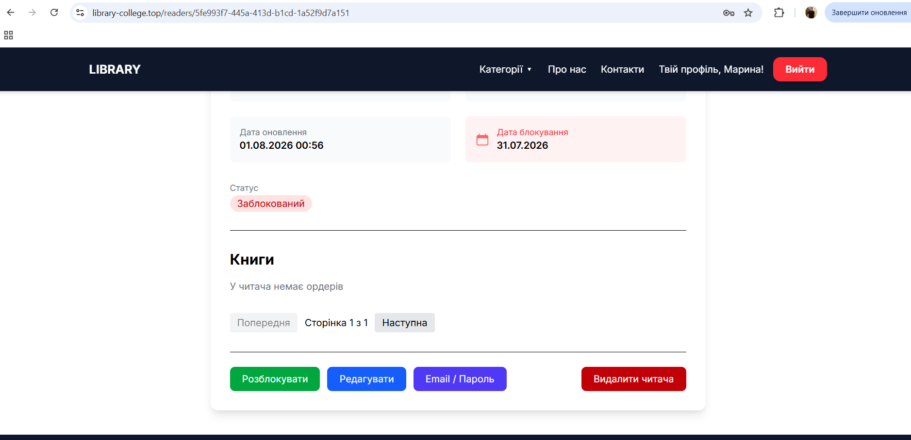
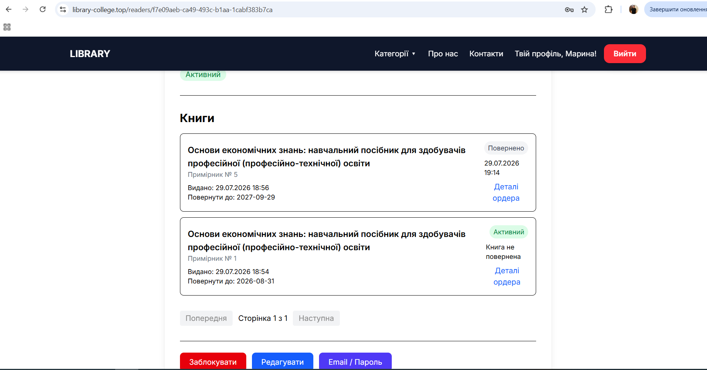
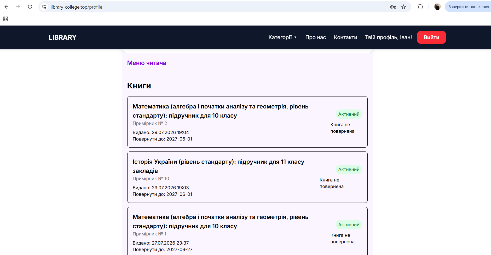

# Library College

A full-stack library management system for an educational institution. The application provides a public book catalogue and role-based tools for managing readers, librarians, books, copies, digital materials, and lending records.

> This is a personal portfolio project built to gain practical experience with backend development, REST APIs, frontend integration, containerization, and production deployment.

[Live website](https://www.library-college.top) · [GitHub repository](https://github.com/IhorBohush/Django_library)

## Tech stack

### Backend

- Python
- Django
- Django REST Framework
- PostgreSQL
- Simple JWT
- Gunicorn

### Frontend

- React
- Vite
- JavaScript
- Axios
- React Router
- Context API
- Tailwind CSS

### Deployment

- Docker and Docker Compose
- Nginx
- Ubuntu VPS
- HTTPS

## Main features

### Authentication and authorization

- Email-based authentication with a custom Django user model
- JWT access and refresh tokens
- Automatic access-token renewal through an Axios interceptor
- Logout with refresh-token blacklisting
- Protected frontend routes
- Role-based permissions for administrators, librarians, and readers
- Password setup flow for newly created reader accounts

### User management

- Create and manage librarian and reader accounts
- Store reader type, profession, graduation date, and account status
- Search, filter, order, and paginate reader records
- Update contact details and login credentials
- Block and reactivate reader accounts

### Library catalogue

- Create and edit books, authors, categories
- Manage multiple physical copies of each book
- Track copy availability
- Upload book covers and electronic materials
- Validate uploaded image and document formats and file size
- Search, filter, and paginate the catalogue

### Lending management

- Issue available book copies to readers
- Track issue dates, due dates, returns, and active orders
- Mark books as returned and restore copy availability
- Search, filter, order, and paginate lending records
- Display total, active, and overdue order statistics
- Allow readers to view only their own lending history

### User interface

- Responsive interface built with React and Tailwind CSS
- Role-aware navigation and profile pages
- Forms for CRUD operations
- Modal dialogs for sensitive actions
- Loading, validation, and API error states
- Ukrainian locale-aware date formatting

## User roles

| Role | Access |
| --- | --- |
| Administrator | Manages librarians and has access to administrative functionality |
| Librarian | Manages readers, catalogue data, book copies, uploads, and lending records |
| Reader | Browses the catalogue, views personal information, and accesses their own lending history |

## Architecture



The production services run in Docker containers. Nginx serves the frontend and uploaded/static files and proxies API requests to Gunicorn. Django REST Framework contains the application logic and communicates with PostgreSQL.

## API overview

The backend exposes REST endpoints for:

- authentication and token refresh;
- the current user's profile;
- readers and librarians;
- professions and actor types;
- books, categories, authors, and physical copies;
- file uploads and book attachments;
- lending orders and reader-specific order history.

List endpoints support relevant combinations of search, filtering, ordering, and pagination. Access is restricted through server-side permission classes, not only through the frontend interface.

## Local development

### Requirements

- Git
- Docker
- Docker Compose

### Run with Docker Compose

1. Clone the repository:

   ```bash
   git clone https://github.com/IhorBohush/Django_library.git
   cd Django_library
   ```

2. Configure the environment variables referenced by the project's Docker Compose configuration. Use secure values for the Django secret key and database credentials. For local development, set the allowed hosts and trusted origins for your local addresses.

3. Build and start the services:

   ```bash
   docker compose -f docker-compose.yml -f docker-compose.dev.yml up --build
   ```

4. Apply migrations if they were not applied automatically by the container entrypoint:

   ```bash
   docker compose exec backend python manage.py migrate
   ```

5. Create an administrator account if required:

   ```bash
   docker compose exec backend python manage.py createsuperuser
   ```

The exact local URLs and exposed ports are defined in `docker-compose.yml`.

## Production deployment

The application is deployed on an Ubuntu VPS using Docker Compose. The production setup includes:

- a Django backend served by Gunicorn;
- a PostgreSQL database with persistent storage;
- Nginx as a reverse proxy and static/media file server;
- persistent volumes for database and uploaded content;
- container health checks and restart policies;
- HTTPS for the public website.

## Project status

The core library workflows are implemented and the application is deployed. The project continues to evolve as part of my learning and portfolio development.

Possible future improvements include automated API tests, OpenAPI documentation, and continuous integration.

## Author

**Ihor Bohush**

- GitHub: [@IhorBohush](https://github.com/IhorBohush)
- Live project: [library-college.top](https://www.library-college.top)

## License

This project is available under the [MIT License](LICENSE).

## Screenshots

### Librarian profile



### Book_detail_for_librarian



### Orders



### Order_detail



### Readers



### Reader_detail_for_librarian_1



### Reader_detail_for_librarian_2



### Reader_detail_for_librarian_3



### Reader_profile


